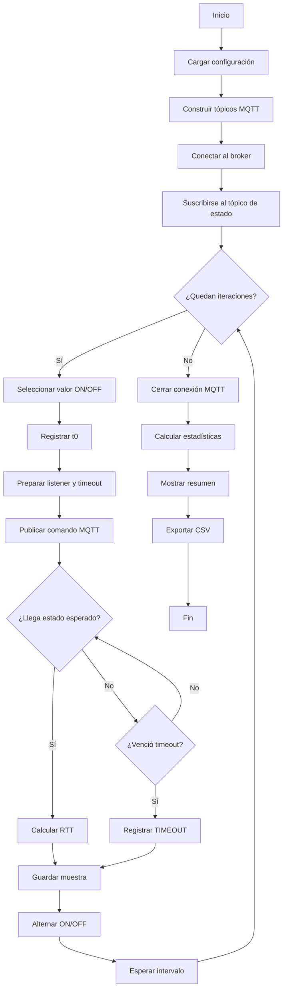
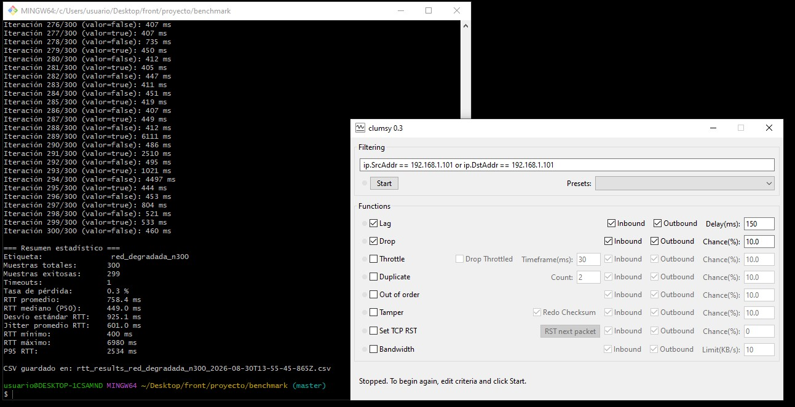

# MQTT RTT Benchmark

Herramienta para medir y caracterizar el comportamiento temporal de una comunicación MQTT entre un cliente de prueba y un actuador/dispositivo.

El benchmark utiliza los mismos tópicos MQTT empleados por la aplicación y permite obtener una **línea base de comportamiento** bajo condiciones normales para posteriormente compararla con escenarios de red degradada.

Este repositorio forma parte del proyecto **Plataforma IoT**, desarrollado como trabajo de tesis de Ingeniería
en Telecomunicaciones. El repositorio principal del proyecto funciona como punto de acceso a la documentación
general y a los distintos componentes del sistema: 🔗 https://github.com/adriangallicet/tesis-plataforma-iot


---


## Objetivo

El objetivo principal es obtener mediciones cuantitativas que permitan caracterizar la comunicación MQTT y comparar diferentes condiciones de operación.

Por ejemplo:

- operación normal;
- red degradada;
- aumento de latencia;
- pérdida de paquetes;
- aumento de la variabilidad del retardo.

El benchmark no pretende medir únicamente la latencia de la red, sino el tiempo observado desde que el cliente publica un comando hasta que recibe la confirmación correspondiente.

---

## Funcionamiento

Para cada iteración, el benchmark:

1. Selecciona el valor que será enviado.
2. Registra el instante de inicio de la medición.
3. Publica el comando MQTT.
4. Espera una confirmación en el tópico de estado.
5. Verifica que la confirmación corresponda al valor solicitado.
6. Calcula el RTT.
7. Si no recibe confirmación dentro del timeout configurado, registra un `TIMEOUT`.
8. Guarda la muestra.
9. Espera el intervalo configurado.
10. Repite el proceso.

Al finalizar todas las iteraciones:

1. Se cierra la conexión MQTT.
2. Se calculan las métricas estadísticas.
3. Se muestra un resumen por consola.
4. Se exportan las muestras individuales a un archivo CSV.

---

## Diagrama general



---

## Medición del RTT

El RTT (Round-Trip Time) se obtiene mediante:

```text
RTT = momento de recepción - momento de envío
```

Conceptualmente:

```text
Cliente / Benchmark
        │
        │ Publica comando
        │ t0
        ▼
   MQTT Broker
        │
        ▼
Aplicación / Dispositivo
        │
        │ Procesamiento
        ▼
   MQTT Broker
        │
        ▼
Cliente / Benchmark
        │
        │ recibe confirmación
        │ t1
        ▼

RTT = t1 - t0
```

El RTT observado puede incluir:

- tiempo de transmisión;
- procesamiento del broker;
- procesamiento de la aplicación/dispositivo;
- tiempo de procesamiento del comando;
- transmisión de la respuesta;
- otros retardos introducidos por los componentes involucrados.

Por este motivo, **RTT no debe interpretarse automáticamente como latencia pura de red**.

---

## Tópicos MQTT

El benchmark replica la estructura de tópicos utilizada por la aplicación:

```text
userId/deviceId/actuatorId/actdata
userId/deviceId/actuatorId/sdata
```

### `actdata`

Tópico utilizado para enviar el comando.

Ejemplo:

```json
{
  "value": true
}
```

### `sdata`

Tópico utilizado para recibir la confirmación del estado.

El benchmark considera válida una respuesta cuando el valor recibido coincide con el valor solicitado en esa iteración.

---

# Métricas

El benchmark calcula diferentes métricas porque ninguna por sí sola describe completamente el comportamiento de la comunicación.

## RTT promedio

Media aritmética de los RTT válidos.

Permite conocer el comportamiento promedio de la comunicación, pero puede verse afectado por valores extremos.

---

## RTT mediano / P50

El percentil 50 representa la mediana.

Indica aproximadamente el valor por debajo del cual se encuentra el 50 % de las mediciones.

Es útil para representar el comportamiento típico y es menos sensible a valores extremos que la media.

---

## Desvío estándar

Mide cuánto se dispersan los RTT respecto de su promedio.

Un desvío estándar elevado indica mayor variabilidad entre las mediciones.

> El desvío estándar y el jitter no son exactamente la misma métrica y no deben interpretarse como sinónimos.

---

## Jitter

El jitter utilizado por este benchmark representa la variabilidad entre RTT consecutivos.

Se calcula mediante las diferencias absolutas:

```text
|RTT₂ - RTT₁|
|RTT₃ - RTT₂|
|RTT₄ - RTT₃|
...
```

y luego se obtiene el promedio de esas diferencias.

Por ejemplo:

```text
RTT:

20 ms
45 ms
25 ms
10 ms
```

Diferencias:

```text
|45 - 20| = 25 ms
|25 - 45| = 20 ms
|10 - 25| = 15 ms
```

Jitter:

```text
(25 + 20 + 15) / 3 = 20 ms
```

### Importante

El jitter se calcula utilizando las mediciones en su **orden temporal original**.

No debe calcularse sobre el array ordenado para los percentiles, ya que ordenar las mediciones elimina la relación entre una medición y la siguiente.

---

## RTT mínimo

Representa el menor RTT observado entre las mediciones válidas.

---

## RTT máximo

Representa el mayor RTT observado.

Es útil para identificar el peor caso observado, aunque un único valor extremo no necesariamente representa el comportamiento habitual.

---

## P95

El percentil 95 indica aproximadamente el valor por debajo del cual se encuentra el 95 % de las mediciones.

Por ejemplo:

```text
P95 = 18 ms
```

significa que aproximadamente el 95 % de los RTT observados fue de 18 ms o menos.

Esta métrica resulta especialmente útil para conocer el comportamiento de la cola de distribución sin depender exclusivamente del máximo.

---

## Tasa de pérdida

Representa el porcentaje de ensayos que no recibieron una confirmación válida dentro del timeout.

```text
tasa de pérdida =
    timeouts / muestras totales × 100
```

Por ejemplo:

```text
100 ensayos
3 timeouts

tasa de pérdida = 3 %
```

Un timeout **no se considera un RTT equivalente al valor del timeout**.

Se almacena como:

```javascript
rtt: null
```

y se contabiliza independientemente como una medición fallida.

---

# ¿Por qué utilizar todas estas métricas?

Consideremos:

```text
10, 11, 12, 11, 10, 45 ms
```

La media aumenta debido al valor de `45 ms`.

La mediana permite observar mejor el comportamiento central.

El máximo permite identificar ese valor extremo.

El P95 ayuda a conocer hasta dónde llega la mayoría de las mediciones.

El desvío estándar permite conocer la dispersión general.

El jitter permite analizar cuánto cambia el RTT entre mediciones consecutivas.

Finalmente, la tasa de pérdida permite detectar ensayos en los que ni siquiera se obtuvo una confirmación.

| Métrica | Qué permite observar |
|---|---|
| Media | Comportamiento promedio |
| Mediana / P50 | Comportamiento típico |
| Desvío estándar | Dispersión |
| Jitter | Variación entre RTT consecutivos |
| Mínimo | Mejor caso observado |
| Máximo | Peor caso observado |
| P95 | Comportamiento de la cola |
| Tasa de pérdida | Ensayos sin confirmación |

---

# Configuración

La configuración principal se encuentra en `CONFIG`:

```javascript
const CONFIG = {
  brokerUrl: 'mqtt://localhost:1883',
  username: 'benchmark',
  password: 'benchmark',

  userId: 'REEMPLAZAR_userId',
  deviceId: 'REEMPLAZAR_deviceId',
  actuatorId: 'REEMPLAZAR_actuatorId',

  iterations: 100,
  delayBetweenMs: 1000,
  timeoutMs: 10000,

  label: 'baseline',
};
```

### Parámetros

| Parámetro | Descripción | Valor por defecto |
|---|---|---:|
| `brokerUrl` | Dirección del broker MQTT | `mqtt://localhost:1883` |
| `username` | Usuario MQTT | `benchmark` |
| `password` | Contraseña MQTT | `benchmark` |
| `userId` | Identificador del usuario | - |
| `deviceId` | Identificador del dispositivo | - |
| `actuatorId` | Identificador del actuador | - |
| `iterations` | Cantidad de ensayos | `100` |
| `delayBetweenMs` | Espera entre ensayos | `1000 ms` |
| `timeoutMs` | Tiempo máximo de espera | `10000 ms` |
| `label` | Identificador del escenario | `baseline` |

### Intervalo entre mediciones

El valor utilizado por defecto es:

```javascript
delayBetweenMs: 1000
```

Es decir, se espera aproximadamente 1 segundo entre ensayos.

Este intervalo se utiliza como condición experimental para evitar una frecuencia de conmutación excesiva del actuador y permitir que el sistema se estabilice entre mediciones.

No debe interpretarse como el "tiempo de respuesta esperado" del relé: el tiempo de respuesta se analiza mediante el RTT.

Para comparar escenarios, es importante mantener este parámetro constante.

---

# Ejecución

Una vez configurados los identificadores:

```bash
node benchmark.js
```

También pueden utilizarse variables de entorno.

Por ejemplo:

```bash
TEST_ITERATIONS=200 TEST_LABEL=red_degradada node benchmark.js
```

---

# Dependencias

El benchmark utiliza Node.js y la librería MQTT.

`fs` forma parte de la biblioteca estándar de Node.js y no requiere instalación adicional.

Instalación:

```bash
npm init -y
npm install mqtt
```

Luego:

```bash
node benchmark.js
```

Se recomienda no versionar `node_modules/`.

Ejemplo de `.gitignore`:

```gitignore
node_modules/
```

---

# Resultado en consola

Un resultado podría verse así:

```text
=== Resumen estadístico ===

Etiqueta:                baseline
Muestras totales:        100
Muestras exitosas:        98
Timeouts:                  2
Tasa de pérdida:         2.0 %

RTT promedio:            12.4 ms
RTT mediano (P50):       11.0 ms
Desvío estándar RTT:      3.2 ms
Jitter promedio RTT:      2.1 ms
RTT mínimo:               8 ms
RTT máximo:              45 ms
P95 RTT:                  17 ms
```

---

# Archivo CSV

Cada ejecución genera un CSV con las muestras individuales:

```csv
iteration,value,rtt_ms
1,true,12
2,false,14
3,true,11
4,false,TIMEOUT
5,true,13
```

Esto permite realizar posteriormente:

- gráficos;
- análisis estadístico;
- comparación entre escenarios;
- procesamiento con Python;
- incorporación a informes.

---

# Uso para establecer una línea base

El benchmark puede utilizarse para establecer una línea base de comunicación.

### Escenario 1 — Baseline

```text
baseline
   ↓
100 mediciones
   ↓
guardar resultados
```

### Escenario 2 — Red degradada

```text
red_degradada
   ↓
100 mediciones
   ↓
guardar resultados
```

---

## Simulación de red degradada

Para generar el escenario de red degradada se utilizó [**clumsy**](https://jagt.github.io/clumsy/), una herramienta para Windows que permite interceptar y manipular el tráfico de red en tiempo real según una condición de filtrado.

Clumsy actúa como un proxy a nivel de driver (WinDivert) que intercepta los paquetes que cumplen el filtro configurado y les aplica una o varias condiciones antes de dejarlos continuar (o descartarlos).

### Filtro utilizado

```text
ip.SrcAddr == 192.168.1.101 or ip.DstAddr == 192.168.1.101
```

Esto limita la manipulación exclusivamente al tráfico hacia/desde el dispositivo bajo prueba, sin afectar el resto de la red.

### Condiciones aplicadas

| Función | Estado | Parámetros |
|---|---|---|
| **Lag** | Activo (Inbound + Outbound) | Delay: `150 ms` |
| **Drop** | Activo (Inbound + Outbound) | Chance: `10 %` |

- **Lag** retrasa artificialmente cada paquete que cumple el filtro, sumando latencia fija en ambos sentidos.
- **Drop** descarta aleatoriamente un porcentaje de los paquetes que cumplen el filtro, simulando pérdida de red.

Ambas condiciones se aplicaron de forma simultánea durante toda la corrida del benchmark, de manera que cada RTT medido refleja el efecto combinado de latencia adicional y pérdida de paquetes.

### Resultado observado

La siguiente captura muestra, en la misma pantalla, la consola con el benchmark ejecutándose bajo esta condición (`red_degradada_n300`) y la configuración de clumsy utilizada:



Se puede observar que, además del incremento general del RTT promedio, aparecen picos puntuales muy por encima del resto (por ejemplo, iteraciones con RTT de `6111 ms` o `4497 ms`). Estos picos son consistentes con el comportamiento esperado de la función **Drop**: cuando un paquete se descarta, la confirmación correspondiente no llega en el intervalo normal y el mensaje debe reintentarse o esperar más tiempo antes de resolverse, lo que se traduce en RTT anómalamente altos dentro de la misma serie de mediciones.

> **Nota:** clumsy manipula el tráfico a nivel de sistema operativo (no es un emulador de red física), por lo que los valores de `Delay` y `Chance` configurados no deben interpretarse como condiciones exactas de una red real degradada, sino como una forma reproducible de introducir latencia y pérdida controladas para poder comparar contra el baseline.

---

Posteriormente pueden compararse:

| Métrica | Baseline | Red degradada |
|---|---:|---:|
| RTT promedio | 12 ms | 31 ms |
| P50 | 11 ms | 27 ms |
| P95 | 17 ms | 58 ms |
| Jitter | 2 ms | 14 ms |
| Pérdida | 0 % | 5 % |

Los valores de esta tabla son únicamente ilustrativos.

La interpretación debe realizarse teniendo en cuenta las condiciones experimentales de cada escenario.

---

# Consideraciones metodológicas

El benchmark mide el comportamiento observado **extremo a extremo desde el cliente que ejecuta el script**.

Por lo tanto, un aumento del RTT no permite determinar por sí solo qué componente produjo la degradación.

Para investigar la causa pueden utilizarse herramientas complementarias:

- Wireshark;
- métricas del broker MQTT;
- métricas del host;
- métricas del dispositivo;
- captura de tráfico;
- análisis de CPU y memoria;
- pruebas de latencia y pérdida;
- pruebas bajo diferentes condiciones de carga.

---

# Limitaciones

Este benchmark no pretende reemplazar una herramienta específica de medición de red.

El RTT observado puede estar influenciado por:

- broker MQTT;
- procesamiento de la aplicación;
- procesamiento del dispositivo;
- carga del host;
- condiciones de red;
- mecanismos de retransmisión;
- cola de mensajes;
- otros factores propios de MQTT y de la aplicación.

Por lo tanto, los resultados deben interpretarse como una **medición del comportamiento de la operación completa**, y no exclusivamente como una medición de la red.

---

# Estructura conceptual del código

El programa puede entenderse en cuatro etapas:

```text
CONFIGURACIÓN
      ↓
ADQUISICIÓN DE MUESTRAS
      ↓
ANÁLISIS ESTADÍSTICO
      ↓
EXPORTACIÓN DE RESULTADOS
```

La lógica MQTT y la lógica estadística se mantienen separadas para facilitar el mantenimiento y la reutilización del código.

---

# Propósito dentro del proyecto

Este benchmark forma parte de la metodología de caracterización de la comunicación de la plataforma.

Su principal utilidad es generar una referencia cuantitativa que permita evaluar posteriormente cómo afectan diferentes condiciones de red al comportamiento de la comunicación y, eventualmente, a los requisitos de desempeño de la aplicación.
